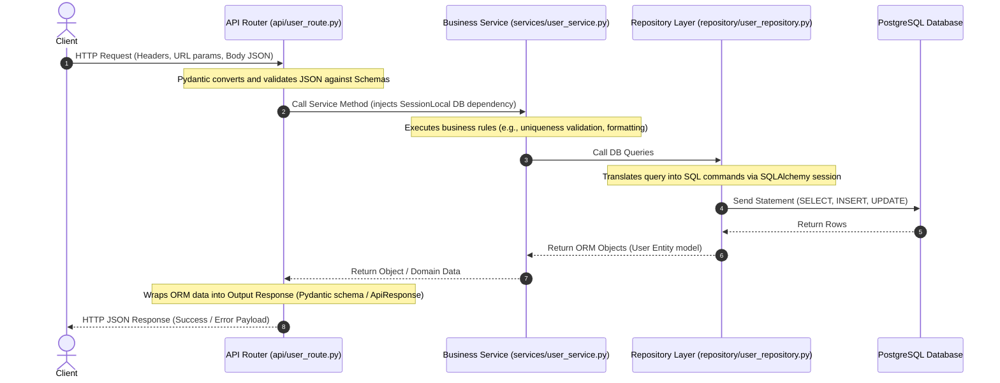
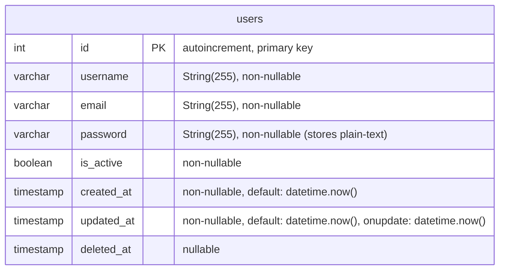

# Coffee Shop Microservices Platform

[](https://fastapi.tiangolo.com/)
[](https://www.python.org/)
[](https://www.sqlalchemy.org/)
[](https://www.postgresql.org/)
[](https://alembic.sqlalchemy.org/)

A modern, microservice-based backend system designed for managing coffee shop operations. The project contains three distinct microservices, with the core **User Service** implementing a robust **Clean Architecture / Domain-Driven Design (DDD)** pattern in FastAPI.

---

## Table of Contents

1. [Project Overview](#1-project-overview)
2. [Project Structure](#2-project-structure)
3. [Technology Stack](#3-technology-stack)
4. [Request Flow](#4-request-flow)
5. [Database Architecture](#5-database-architecture)
6. [API Documentation](#6-api-documentation)
7. [Installation Guide](#7-installation-guide)
8. [Configuration & Environment Variables](#8-configuration-environment-variables)
9. [Database Setup & Migrations](#9-database-setup--migrations)
10. [Running the Project](#10-running-the-project)
11. [API Testing](#11-api-testing)
12. [Security Architecture](#12-security-architecture)
13. [Error Handling & Global Exception Handler](#13-error-handling--global-exception-handler)
14. [Logging Infrastructure](#14-logging-infrastructure)
15. [Architectural Review & Best Practices](#15-architectural-review--best-practices)
16. [Contributing](#16-contributing)
17. [License](#17-license)

---

## 1. Project Overview

This repository hosts a multi-service coffee shop platform. It uses a microservice architecture to isolate domains:
*   **User Service**: Manages customer and administrator user profiles, credential metadata, and account statuses. It uses a database to store user records.
*   **Operation Service**: A skeletal placeholder microservice for managing orders, checkout, and inventory operations.
*   **Report Service**: A skeletal placeholder microservice for generating coffee shop analytics, sales summaries, and reports.

### Architecture Pattern of User Service
The `user_service` is built using a highly structured, layered Clean Architecture layout:
1.  **API Layer (`app/api`)**: Entry point for HTTP requests. Handles request payload validation and response formatting.
2.  **Service Layer (`app/services`)**: Orchestrates business rules, sanitizes input, and handles domain actions.
3.  **Repository Layer (`app/repository`)**: Abstract interface wrapping the database querying framework.
4.  **Models Layer (`app/models`)**: Defines SQLAlchemy ORM database structures.
5.  **Schemas Layer (`app/schemas`)**: Holds Pydantic validation structures.
6.  **Core Layer (`app/core`)**: Implements database engines, application settings, exceptions, and global error handlers.

---

## 2. Project Structure

The project directory is structured as follows:

```text
coffee_shop/
│
├── operation_service/              # Operation management microservice (Skeletal)
│   ├── main.py                     # Entry point for Operation Service
│   └── test_main.http              # HTTP request test files
│
├── report_service/                 # Analytics and reporting microservice (Skeletal)
│   ├── main.py                     # Entry point for Report Service
│   └── test_main.http              # HTTP request test files
│
├── user_service/                   # User profile and Auth microservice (Core)
│   └── app/
│       ├── api/                    # API Routing Layer
│       │   └── user_route.py       # User REST endpoints
│       │
│       ├── core/                   # Core configurations
│       │   ├── config.py           # Environment config parsing (dotenv)
│       │   ├── database.py         # SQLAlchemy engine and sessionmaker setup
│       │   ├── exception.py        # Custom business exception classes
│       │   └── exception_handler.py# Global FastAPI error middleware
│       │
│       ├── dependencies/           # FastAPI dependency providers
│       │   └── db.py               # Database session generator (yield-based)
│       │
│       ├── models/                 # Database ORM models
│       │   └── user.py             # User SQL table definition
│       │
│       ├── repository/             # Data access layer
│       │   └── user_repository.py  # Repository functions for User queries
│       │
│       ├── schemas/                # Input/Output validation schemas
│       │   ├── api_response.py     # Generic standardized JSON envelopes
│       │   └── user_schema.py      # User Pydantic request/response schemas
│       │
│       ├── services/               # Core business logic layer
│       │   └── user_service.py     # UserService business methods
│       │
│       ├── main.py                 # FastAPI application instantiation
│       └── test_main.http          # REST Client execution file
│
├── requirements.txt                # Unified dependencies manifest
└── README.md                       # Comprehensive project documentation
```

### Folder Responsibilities

*   `operation_service/` & `report_service/`: Run as independent FastAPI servers, providing domain separation for orders and reports.
*   `user_service/app/api/`: Maps incoming HTTP routes to business logic services. No database queries or business operations happen here.
*   `user_service/app/core/`: Contains initialization code that coordinates global behaviors like configurations, database drivers, and global exceptions.
*   `user_service/app/dependencies/`: Injection functions used to instantiate resources (such as DB connections) automatically for endpoints.
*   `user_service/app/models/`: Declarations of the physical DB tables, indices, and schema layouts.
*   `user_service/app/repository/`: Handles raw database CRUD queries using SQLAlchemy, encapsulating ORM operations.
*   `user_service/app/schemas/`: Contains schemas that handle request validation and response filtering.
*   `user_service/app/services/`: The hub of business rule logic, validating constraints, modifying domain entities, and wrapping db transactions.

---

## 3. Technology Stack

| Technology | Version | Purpose |
| :--- | :--- | :--- |
| **Python** | `3.10+` | Core programming language |
| **FastAPI** | `0.137.1` | REST API construction framework |
| **SQLAlchemy** | `2.0.51` | Object-Relational Mapper (ORM) using modern Type-Mapped Column mappings |
| **Alembic** | `1.18.4` | Database schema migrations management (supported in packages) |
| **PostgreSQL** | `15+` | Production relation database engine |
| **Pydantic** | `2.13.4` | Input parsing, structural constraint verification, and serialization |
| **psycopg2-binary**| `2.9.12` | PostgreSQL engine adapter for Python |
| **python-dotenv** | `1.2.2` | Environment configuration injector |
| **Uvicorn** | `0.49.0` | High-performance ASGI server for local running |

---

## 4. Request Flow

The execution workflow when a client interacts with the system uses a unidirectional pipeline. The diagram below illustrates how a query propagates and returns:



### Detailed Layer Actions:
1.  **Request Input**: The client makes an HTTP call. FastAPI automatically verifies path parameters and parses the HTTP body into a matching Pydantic class (`CreateUserRequest` or `UpdateUserRequest`). If validation fails, it short-circuits and returns a `422 Unprocessable Entity` response.
2.  **Route Processing**: The router handles routing, resolves the database dependency `get_db()`, and invokes the corresponding service method.
3.  **Service Action**: The service method processes the business logic (e.g. raises an `EmailAlreadyExists` exception if the email is taken).
4.  **Database Querying**: The repository accesses database rows using the active session.
5.  **Serialization**: The router wraps the output in a matching Pydantic model (`UserResponse` or `ApiResponse[UserResponse]`), automatically filtering out sensitive attributes like passwords.

---

## 5. Database Architecture

The database configuration in `user_service` communicates with a PostgreSQL database. 

### Table Definition: `users`
This is the only table currently defined in the system:

*   **Primary Key**: `id` (Integer, auto-incrementing).
*   **Unique Index**: `email` (Enforced at the service layer; database index can be applied during migration).
*   **Soft Delete**: `deleted_at` allows flagging items as deleted without removing the physical record.



### Columns & Attribute Table

| Column Name | Data Type | Constraints | Default Value | Description |
| :--- | :--- | :--- | :--- | :--- |
| **id** | `Integer` | Primary Key, Autoincrement | *None* | Unique record ID |
| **username** | `String(255)` | Non-Nullable | *None* | Display name of the user |
| **email** | `String(255)` | Non-Nullable | *None* | User email address (unique) |
| **password** | `String(255)` | Non-Nullable | *None* | Login password |
| **is_active** | `Boolean` | Non-Nullable | *None* | Identifies if user login is active |
| **created_at** | `DateTime` | Non-Nullable | `datetime.now()` | Account creation timestamp |
| **updated_at** | `DateTime` | Non-Nullable | `datetime.now()` | Timestamp of last modification |
| **deleted_at** | `DateTime` | Nullable | `None` | Soft deletion timestamp |

---

## 6. API Documentation

### Endpoints Breakdown

| Service | Method | Endpoint | Description | Request Body | Response Format |
| :--- | :--- | :--- | :--- | :--- | :--- |
| **User** | `POST` | `/user` | Creates a new user | `CreateUserRequest` | `UserResponse` |
| **User** | `GET` | `/user` | Fetches all users | *None* | `list[UserResponse]` |
| **User** | `GET` | `/user/{user_id}`| Gets user by ID | *None* | `ApiResponse[UserResponse]` |
| **User** | `PUT` | `/user/{user_id}`| Updates user attributes | `UpdateUserRequest` | `UserResponse` |
| **Operation**| `GET` | `/` | Hello World index | *None* | Plain JSON object |
| **Operation**| `GET` | `/hello/{name}`| Hello greeting | *None* | Plain JSON object |
| **Report** | `GET` | `/` | Hello World index | *None* | Plain JSON object |
| **Report** | `GET` | `/hello/{name}`| Hello greeting | *None* | Plain JSON object |

---

### Request & Response Payload Examples (`user_service`)

#### 1. Create User
*   **Endpoint**: `POST /user`
*   **Request Body JSON**:
    ```json
    {
      "username": "johndoe",
      "email": "john.doe@example.com",
      "password": "supersecurepassword123",
      "is_active": true
    }
    ```
*   **Response Body JSON (200 OK)**:
    ```json
    {
      "id": 1,
      "username": "johndoe",
      "email": "john.doe@example.com"
    }
    ```

#### 2. Get User By ID
*   **Endpoint**: `GET /user/1`
*   **Response Body JSON (200 OK)**:
    ```json
    {
      "success": true,
      "error_code": null,
      "message": "User fetched successfully",
      "data": {
        "id": 1,
        "username": "johndoe",
        "email": "john.doe@example.com"
      }
    }
    ```

#### 3. Update User
*   **Endpoint**: `PUT /user/1`
*   **Request Body JSON**:
    ```json
    {
      "username": "johndoe_updated",
      "email": "john.doe@example.com",
      "password": "newpassword456",
      "is_active": true
    }
    ```
*   **Response Body JSON (200 OK)**:
    ```json
    {
      "id": 1,
      "username": "johndoe_updated",
      "email": "john.doe@example.com"
    }
    ```

#### 4. Email Already Exists (Conflict)
*   **Endpoint**: `POST /user`
*   **Response Body JSON (409 Conflict)**:
    ```json
    {
      "success": false,
      "error_code": "err_409",
      "message": "Email john.doe@example.com already exists",
      "data": null
    }
    ```

---

## 7. Installation Guide

Follow these steps to configure the environment and run the services locally.

### Step 1: Clone the Repository
```bash
git clone <repository-url>
cd coffee_shop
```

### Step 2: Establish a Virtual Environment

#### Windows
```powershell
python -m venv .venv
.venv\Scripts\activate
```

#### Linux / macOS
```bash
python3 -m venv .venv
source .venv/bin/activate
```

### Step 3: Install Package Dependencies
```bash
pip install -r requirements.txt
```

---

## 8. Configuration & Environment Variables

The application configurations are managed inside `user_service/app/core/config.py` using `python-dotenv`. Create an `.env` file inside the `user_service/app/` folder before launching:

```env
# Database Credentials
DB_HOST=localhost
DB_PORT=5432
DB_NAME=user_service_db
DB_USER=postgres
DB_PASSWORD=your_secure_password
```

### Environment Config Variables Explanation

| Environment Key | Expected Value Example | Purpose |
| :--- | :--- | :--- |
| `DB_HOST` | `localhost` | Host address of PostgreSQL server |
| `DB_PORT` | `5432` | TCP port PostgreSQL is listening on |
| `DB_NAME` | `user_service_db` | Target PostgreSQL database name |
| `DB_USER` | `postgres` | User account authorized to connect to DB |
| `DB_PASSWORD` | `123` | Password for DB user account |

---

## 9. Database Setup & Migrations

### 1. Database Creation
Ensure that you have PostgreSQL running. Run a SQL script or execute standard terminal commands to create the target database before initiating the server:
```sql
CREATE DATABASE user_service_db;
```

### 2. Automatic Schema Creation (Local Dev Only)
By default, the application runs dynamic database initialization inside `user_service/app/main.py`:
```python
Base.metadata.create_all(bind=engine)
```
This script will inspect PostgreSQL, detect missing tables, and compile the `users` table layout dynamically upon application boot.

### 3. Alembic Migrations (Production Recommended Setup)
Although `alembic` is part of `requirements.txt`, migrations are not currently initialized. To migrate to an Alembic setup:
1.  Initialize Alembic from the `user_service` folder:
    ```bash
    alembic init alembic
    ```
2.  Edit `alembic.ini` to read your database URL or modify `alembic/env.py` to source the database connection URL dynamically from `Settings`.
3.  Configure `target_metadata` in `alembic/env.py`:
    ```python
    from app.core.database import Base
    target_metadata = Base.metadata
    ```
4.  Generate initial schema version:
    ```bash
    alembic revision --autogenerate -m "create users table"
    ```
5.  Perform upgrade:
    ```bash
    alembic upgrade head
    ```

---

## 10. Running the Project

Since this is a multi-service workspace, each microservice can be run individually. Activate your virtual environment and run the services below:

### 1. Run User Service (Core)
```bash
cd user_service
uvicorn app.main:app --reload --port 8000
```
This initiates the core service on `http://127.0.0.1:8000`.

### 2. Run Operation Service
```bash
cd operation_service
uvicorn main:app --reload --port 8001
```
This initiates the operation helper on `http://127.0.0.1:8001`.

### 3. Run Report Service
```bash
cd report_service
uvicorn main:app --reload --port 8002
```
This initiates the report helper on `http://127.0.0.1:8002`.

---

## 11. API Testing

You can interact with and test the APIs in several ways:

### 1. Swagger UI
FastAPI automatically compiles interactive OpenAPI documentation.
*   **User Service Docs**: Navigate to [http://127.0.0.1:8000/docs](http://127.0.0.1:8000/docs)
*   **Operation Service Docs**: Navigate to [http://127.0.0.1:8001/docs](http://127.0.0.1:8001/docs)
*   **Report Service Docs**: Navigate to [http://127.0.0.1:8002/docs](http://127.0.0.1:8002/docs)

### 2. ReDoc API Documentation
Access alternative ReDoc visual layouts by visiting:
*   [http://127.0.0.1:8000/redoc](http://127.0.0.1:8000/redoc)

### 3. curl Commands
```bash
# Fetch all users
curl -X GET http://127.0.0.1:8000/user

# Create user
curl -X POST http://127.0.0.1:8000/user \
  -H "Content-Type: application/json" \
  -d "{\"username\": \"alice\", \"email\": \"alice@example.com\", \"password\": \"secret123\", \"is_active\": true}"
```

### 4. REST Client (test_main.http)
If you are using Visual Studio Code or PyCharm, open the `test_main.http` files located inside each service folder to send test requests directly.

---

## 12. Security Architecture

### Current Implementation & Limitations:
*   **Password Hashing**: Currently **absent**. Passwords sent through `POST /user` are saved directly as plain text in the PostgreSQL database.
*   **JWT Token Authorization**: Currently **absent**. All routes are unprotected, and there are no token authentication mechanisms.
*   **CORS Configuration**: Currently **absent**. There is no Cross-Origin Resource Sharing middleware declared.
*   **SQL Injection Protection**: **Fully active** by default. Because the application interacts with PostgreSQL using SQLAlchemy's parameterized queries (via session objects), SQL injection attacks are blocked.
*   **XSS Protection**: Secure JSON formatting is enforced by FastAPI's responses, preventing raw HTML payloads from executing in client browsers.

---

## 13. Error Handling & Global Exception Handler

The project uses a centralized error-handling design using custom application exceptions and FastAPI exception middleware.

### 1. Base Class: `ApplicationError`
All custom business exceptions inherit from `ApplicationError` (found in `user_service/app/core/exception.py`). It accepts a custom error message, error code, and HTTP status code.

### 2. Concrete Exceptions
*   `UserNotFound(user_id)`: Triggers status code `404 Not Found` with code `"err_404"`.
*   `EmailAlreadyExists(email)`: Triggers status code `409 Conflict` with code `"err_409"`.

### 3. Global Middleware Handler
The handler catches `ApplicationError` globally (configured in `main.py`):
```python
async def application_error_handler(request: Request, exception: ApplicationError):
    return JSONResponse(
        status_code=exception.status_code,
        content={
            "success": False,
            "error_code": exception.error_code,
            "message": exception.message,
            "data": None
        }
    )
```

---

## 14. Logging Infrastructure

Currently, the application does not configure standard Python logging handlers or structured JSON loggers. Standard outputs are piped directly into the Uvicorn worker's terminal interface.

For enterprise environments, it is recommended to set up structured logging (e.g. using `structlog` or standard library logging formatters) to track HTTP requests and SQL execution plans.

---

## 15. Architectural Review & Best Practices

During the codebase audit, several security risks, architectural gaps, and bugs were identified. Below are details, along with recommended code solutions.

### 1. Plain Text Password Storage (Critical Security Bug)
*   **Problem**: Plain-text password storage inside the database violates standard compliance audits (e.g. OWASP, PCI-DSS).
*   **Solution**: Install `passlib` and `bcrypt` to encrypt passwords before write operations.
*   **Refactored Code Example**:
    ```python
    # user_service/app/services/user_service.py
    from passlib.context import CryptContext

    pwd_context = CryptContext(schemes=["bcrypt"], deprecated="auto")

    # Inside UserService
    def create_user(self, db: Session, request: CreateUserRequest):
        # ... validation ...
        data = request.model_dump()
        data["password"] = pwd_context.hash(data["password"])  # Hashing step
        user = User(**data)
        return user_repo.create(db, user)
    ```

### 2. Timestamp Evaluation Evaluated Once (Database Bug)
*   **Problem**: In `user_service/app/models/user.py`, `created_at` uses `default=datetime.now()`. Calling the function with parentheses evaluates the timestamp only *once* during startup. Every user row inserted thereafter will share this initial start time.
*   **Solution**: Pass the callable reference without parentheses, or use SQL server defaults.
*   **Refactored Code Example**:
    ```python
    # Replace:
    created_at: Mapped[datetime] = mapped_column(DateTime, default=datetime.now())
    # With:
    created_at: Mapped[datetime] = mapped_column(DateTime, default=datetime.now) # Passed reference
    # Or:
    from sqlalchemy.sql import func
    created_at: Mapped[datetime] = mapped_column(DateTime, server_default=func.now())
    ```

### 3. Inconsistent Exception Throwing (Code Smell)
*   **Problem**: `UserService.create_user` raises the custom `EmailAlreadyExists` exception, whereas `UserService.update_user` raises standard FastAPI `HTTPException(400, "Email already exists")`. This creates inconsistent API responses.
*   **Solution**: Raise standard custom exceptions across all service methods.
*   **Refactored Code Example**:
    ```python
    # Inside UserService.update_user
    if user.email != request.email:
        email_exists = user_repo.get_by_email(db, request.email)
        if email_exists:
            raise EmailAlreadyExists(request.email) # Consistent Application Exception
    ```

### 4. Direct Table Instantiation (Operational Smell)
*   **Problem**: Running `Base.metadata.create_all(bind=engine)` inside `main.py` blocks database upgrades and schema evolutions.
*   **Solution**: Remove this database call from production startup files and use Alembic migrations to manage database revisions.

### 5. Absence of JWT Authentication
*   **Problem**: Anyone can read and update accounts because routes do not require verification.
*   **Solution**: Implement JWT authentication middleware or dependencies to secure endpoints.

---

## 16. Contributing

1.  Fork the Project.
2.  Create your Feature Branch (`git checkout -b feature/AmazingFeature`).
3.  Commit your Changes (`git commit -m 'Add some AmazingFeature'`).
4.  Push to the Branch (`git push origin feature/AmazingFeature`).
5.  Open a Pull Request.

---

## 17. License

Distributed under the MIT License. See `LICENSE` for more information.
